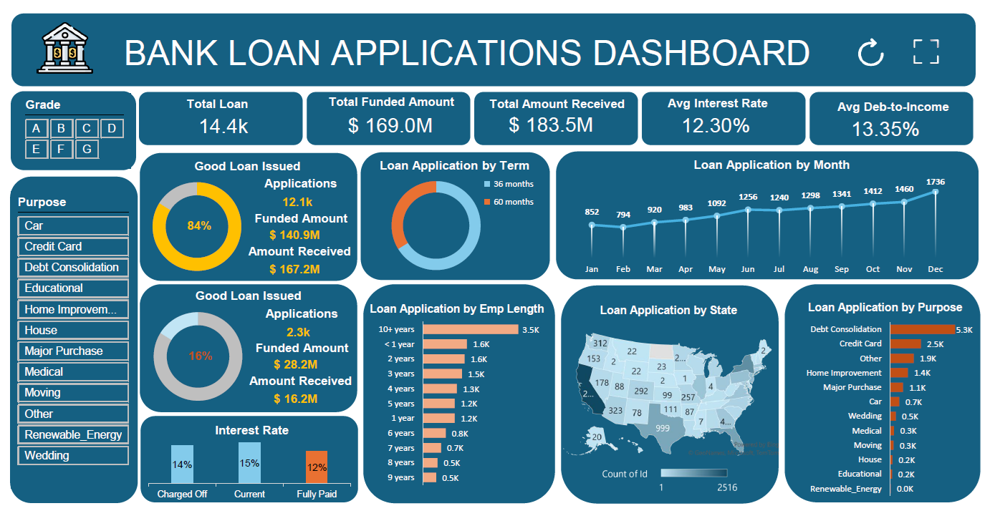

# 📊 Bank Loan Application Tracking Dashboard — Excel

> **Interactive Excel Dashboard phân tích 14,384 hồ sơ vay ngân hàng sử dụng Pivot Tables, Slicers, và KPI Cards**

---

## 📌 Project Overview

Dự án xây dựng dashboard tương tác trong Microsoft Excel để theo dõi và phân tích hiệu suất danh mục cho vay của ngân hàng. Dashboard cung cấp cái nhìn toàn diện về chất lượng hồ sơ vay, phân loại Good Loan / Bad Loan, xu hướng theo thời gian và các chỉ số tài chính quan trọng.

---

## 🎯 Business Questions

1. Tổng quan danh mục cho vay: bao nhiêu hồ sơ, tổng giá trị, tỷ lệ thu hồi?
2. Tỷ lệ Good Loan vs Bad Loan là bao nhiêu?
3. Mục đích vay nào chiếm tỷ trọng lớn nhất?
4. Grade và Term nào có rủi ro cao nhất?
5. Xu hướng hồ sơ vay thay đổi theo tháng như thế nào?

---

## 🛠️ Excel Skills Demonstrated

| Kỹ năng | Ứng dụng |
|---------|----------|
| **Pivot Tables** | Tổng hợp dữ liệu theo nhiều chiều (State, Purpose, Grade, Term) |
| **Pivot Charts** | Bar, Line, Donut charts kết nối trực tiếp với Pivot Tables |
| **Slicers** | Filter tương tác theo Loan Status, Term, Purpose |
| **KPI Cards** | Tổng hợp số liệu tổng quan (COUNTIF, SUMIF, AVERAGEIF) |
| **Conditional Formatting** | Highlight Good Loan / Bad Loan |
| **XLOOKUP / COUNTIF / SUMIF** | Tính toán các chỉ số động |
| **Data Validation** | Kiểm soát chất lượng dữ liệu đầu vào |
| **Dashboard Design** | Layout chuyên nghiệp, color scheme thống nhất |

---

## 📁 File Structure

```
Bank_Loan_Applications.xlsx
├── Data        ← Raw data 14,384 records, 25 columns
├── Pivot       ← Pivot Tables tổng hợp các chiều phân tích
└── Dashboard   ← Interactive Dashboard với KPIs + Charts + Slicers
```

---

## 📊 Dataset Overview

| Thông tin | Chi tiết |
|-----------|----------|
| Tổng hồ sơ | **14,384** loan applications |
| Tổng giá trị cho vay | **$169,023,600** |
| Tổng thu hồi | **$183,455,468** |
| Lãi suất trung bình | **12.30%** |
| DTI trung bình | **13.35%** |
| Thời gian dữ liệu | 2021–2022 |

**Các trường dữ liệu chính (25 columns):**
`Id`, `Address_State`, `Application_Type`, `Emp_Length`, `Grade`, `Home_Ownership`, `Issue_Date`, `Loan_Status`, `Good vs Bad Loan`, `Purpose`, `Term`, `Annual_Income`, `Dti`, `Int_Rate`, `Loan_Amount`, `Total_Payment`...

---

## 📈 Key Metrics & Findings

### Loan Quality

| Phân loại | Số lượng | Tỷ lệ |
|-----------|----------|-------|
| ✅ Good Loan (Fully Paid + Current) | 12,100 | **84.1%** |
| ❌ Bad Loan (Charged Off) | 2,284 | **15.9%** |

### Loan Status Breakdown

| Status | Count |
|--------|-------|
| Fully Paid | 11,587 |
| Charged Off | 2,284 |
| Current | 513 |

### Top Loan Purposes

| Mục đích | Số hồ sơ |
|----------|----------|
| Debt Consolidation | 5,268 |
| Credit Card | 2,499 |
| Other | 1,912 |
| Home Improvement | 1,438 |
| Major Purchase | 1,055 |

### Loan Grade Distribution

| Grade | Count | Rủi ro |
|-------|-------|--------|
| A | 3,399 | Thấp nhất |
| B | 4,203 | Thấp |
| C | 2,957 | Trung bình |
| D | 2,032 | Cao |
| E–G | 1,793 | Cao nhất |

### Loan Term

| Term | Count |
|------|-------|
| 36 months | 9,528 (66.2%) |
| 60 months | 4,856 (33.8%) |

---

## 💡 Key Insights

**1. Danh mục cho vay khá lành mạnh** với 84.1% là Good Loan, tỷ lệ thu hồi vượt giá trị cho vay ($183M vs $169M).

**2. Debt Consolidation** là mục đích vay phổ biến nhất (36.6%) — phản ánh nhu cầu tái cơ cấu nợ cao trong thị trường.

**3. Grade B** chiếm tỷ trọng lớn nhất (29.2%), cùng với Grade A tạo thành 53% danh mục — nền tảng chất lượng tốt.

**4. Term 36 tháng** được ưa chuộng hơn (66.2%) so với 60 tháng, cho thấy xu hướng vay ngắn hạn.

**5. DTI trung bình 13.35%** — thấp hơn ngưỡng rủi ro 40%, danh mục tổng thể an toàn.

---

## 🖥️ Dashboard Preview

> *(Upload ảnh chụp màn hình dashboard vào thư mục `images/` và cập nhật link bên dưới)*



---

## 🚀 How to Use

1. Download file `Bank_Loan_Applications.xlsx`
2. Mở bằng **Microsoft Excel 2016 trở lên** (để hỗ trợ Slicers)
3. Vào sheet **Dashboard** để xem tổng quan
4. Dùng **Slicers** để filter theo: Loan Status, Term, Purpose, Grade
5. Vào sheet **Pivot** để xem chi tiết các bảng tổng hợp
6. Vào sheet **Data** để xem raw data gốc

---

## 📞 Contact

**Nguyễn Minh Hiếu** 

📱 0972.026.185
📧 hieunm0908.work@gmail.com
💼 [linkedin.com/in/hieunm0908-work](https://linkedin.com/in/hieunm0908-work)
